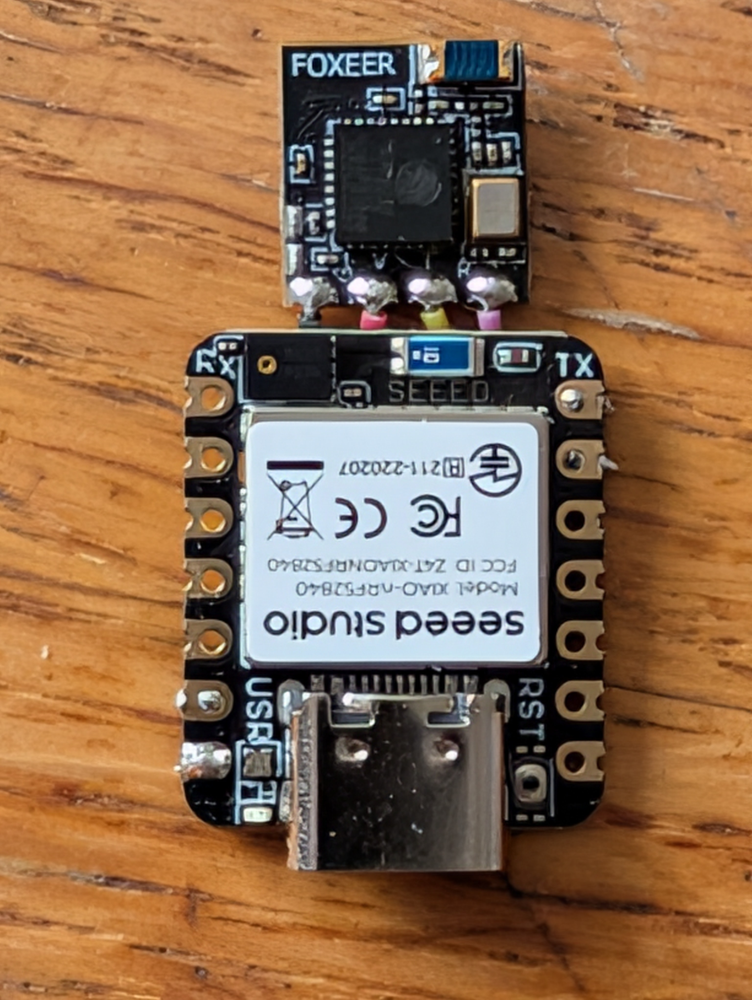
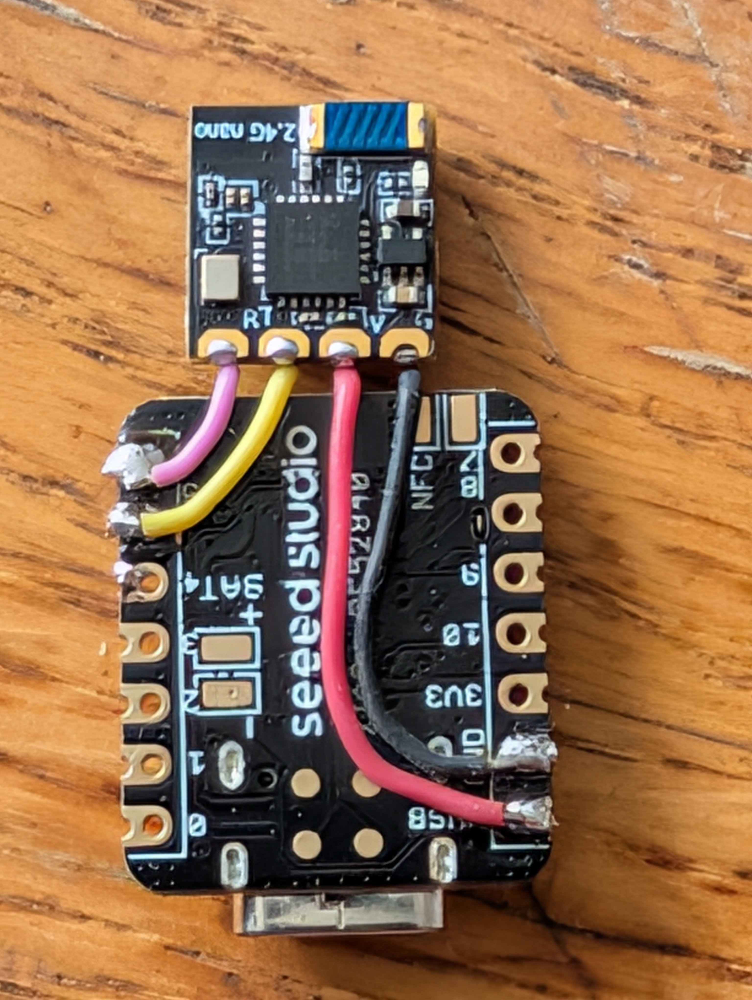

# USB ELRS Receiver Dongle

> Transform an **ExpressLRS (ELRS) Receiver** and a **Seeed Studio XIAO nRF52840** into a high-speed, zero-latency USB HID Gamepad dongle for PC and laptop FPV simulators.

---

## 📌 Overview

This project turns a compact ELRS receiver (such as the Foxeer Lite ELRS RX) and a Seeed Studio XIAO nRF52840 into a permanent, plug-and-play USB HID joystick for FPV simulators (VelociDrone, Liftoff, Uncrashed, Tryp FPV, DCL, etc.).

Once plugged into your PC or laptop, it sits quietly in the background and automatically connects whenever you turn on your radio transmitter.

---

## ✨ Features

- ⚡ **Ultra-Fast Polling (1000 Hz / 1ms)**: Configured with `Adafruit_TinyUSB` for 1ms USB HID report intervals for minimum latency.
- 📡 **420k Baud CRSF Support**: Direct hardware register timing overrides (`NRF_UARTE0->BAUDRATE`) for exact 420,000 baud CRSF protocol parsing via `AlfredoCRSF`.
- 🎛️ **Full Radio Control Support (Optimized for Radiomaster GX12 / TX16S / Boxer / Pocket)**:
  - **4 Axis Sticks**: Roll, Pitch, Throttle, Yaw (CH1–CH4)
  - **2 Sliders/Dials**: S1, S2 (CH5–CH6)
  - **4 Toggle & Momentary Switches**: SA, SD, SG, SH (CH7–CH10 → HID Buttons 1–4)
  - **4 Cumulative 3-Position Switches**: SE, SB, SC, SF (CH11–CH14 → HID Buttons 5–12)
- 🟢 **Link Status LED**: Built-in green LED lights up solid when the ELRS receiver link is active.
- 🪶 **Compact & Antenna-Free**: Uses compact receiver models (like Foxeer Lite ELRS with onboard ceramic antenna) so no long external dipoles get in the way.

---

## 🛠️ Hardware Requirements

| Component | Recommendation | Notes |
| :--- | :--- | :--- |
| **Microcontroller** | Seeed Studio XIAO nRF52840 | Native USB stack & fast hardware UART |
| **ELRS Receiver** | Foxeer Lite ELRS RX (or similar) | Integrated SMD ceramic antenna; ideal for desk/room range |
| **Wiring** | 4-wire connection | Power, Ground, TX, RX |

---

## 🔌 Wiring & Pinout

Connect the ELRS receiver to the XIAO nRF52840 as follows:

| Seeed XIAO nRF52840 Pin | ELRS Receiver Pin | Description |
| :---: | :---: | :--- |
| **5V / 3V3** | **VCC** | Power Supply |
| **GND** | **GND** | Ground |
| **D5** | **TX** | XIAO Serial1 RX $\leftarrow$ Receiver TX |
| **D6** | **RX** | XIAO Serial1 TX $\rightarrow$ Receiver RX |

### 🖼️ Circuit Diagrams

#### Top Side Soldering Layout

#### Bottom Side Soldering Layout

---

## 🕹️ Channel Mapping

| Channel | Radio Input | HID Mapping | Description |
| :---: | :---: | :---: | :--- |
| **CH1** | Roll | `X` Axis | Stick Roll (-127 to 127) |
| **CH2** | Pitch | `Y` Axis | Stick Pitch (-127 to 127) |
| **CH3** | Throttle | `Z` Axis | Stick Throttle (-127 to 127) |
| **CH4** | Yaw | `Rz` Axis | Stick Yaw (-127 to 127) |
| **CH5** | Slider S1 | `Rx` Axis | Auxiliary Slider 1 |
| **CH6** | Slider S2 | `Ry` Axis | Auxiliary Slider 2 |
| **CH7** | Switch SA | Button 1 | Toggle / Momentary Switch |
| **CH8** | Switch SD | Button 2 | Toggle / Momentary Switch |
| **CH9** | Switch SG | Button 3 | Toggle / Momentary Switch |
| **CH10** | Switch SH | Button 4 | Toggle / Momentary Switch |
| **CH11** | Switch SE | Buttons 5 & 6 | Cumulative 3-Pos Switch |
| **CH12** | Switch SB | Buttons 7 & 8 | Cumulative 3-Pos Switch |
| **CH13** | Switch SC | Buttons 9 & 10 | Cumulative 3-Pos Switch |
| **CH14** | Switch SF | Buttons 11 & 12 | Cumulative 3-Pos Switch |

> [!NOTE]
> **3-Position Switch Logic**:
> - **Pushed Away** (`< 1300µs`): Both buttons OFF
> - **Middle Position** (`1300µs – 1700µs`): Button A ON
> - **Pulled Near** (`> 1700µs`): Button A ON + Button B ON

---

## 💻 Software Setup

### Prerequisites

1. **Arduino IDE** (v2.x recommended)
2. **Seeed nRF52840 Board Support**:
   - Add Seeed nRF52840 package via Arduino Board Manager (`Seeed nRF52840 Boards`).
3. **Required Libraries**:
   - `Adafruit TinyUSB Library`
   - `AlfredoCRSF`

### Flashing

1. Select Board: **Seeed XIAO nRF52840**
2. Select USB Stack: **Adafruit TinyUSB** (*Tools > USB Stack > Adafruit TinyUSB*)
3. Open [`usb-elrs-seed-xiao-nrf52840.ino`](usb-elrs-seed-xiao-nrf52840.ino)
4. Compile and Upload!

---

## 🚀 Future Enhancements

- [ ] Design and 3D print a custom protective enclosure.

